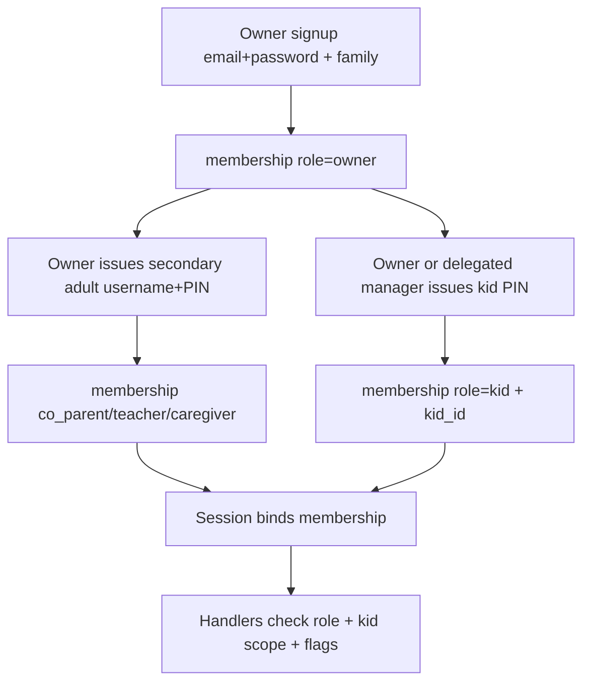

# Auth roadmap (design only)

Status: design discussion artifact. No product implementation in this phase
beyond what already ships (hosted email+password, one user ↔ one family).

## Goals

- Keep **family** as the tenancy boundary (data dir / `school.db`).
- Shape control-plane identity so **many principals** can authenticate into one
  family with **RBAC**, without painting ourselves into “one Mom account.”
- Separate **who you are** (credentials) from **what you may do** (role +
  optional kid scope) from **which household** (family membership).
- Let the **owner** issue and fix household logins (PINs) without giving
  secondary adults access to sensitive tenant Settings.

## Today (hosted)

```
users.family_id  →  one parent per family
sessions         →  (user_id, family_id)
INVITE_CODE      →  deploy-wide gate to create a family
```

Local mode stays optional house password; not the multi-user model.

## Target concepts

| Concept | Meaning |
| --- | --- |
| **Family** | Tenant; owns data under `families/{id}/` |
| **Account** | Login identity — **owner email+password** or a **family-issued PIN principal** |
| **Membership** | Account ↔ family + **role** (+ optional kid scope + capability flags) |
| **Role** | Named permission bundle (see below) |
| **Kid subject** | Domain child record; linked to a kid PIN membership scoped to that child |
| **Adult subject** | Domain adult record; may link to a secondary adult PIN membership |
| **Issuance** | Owner (or delegated kid-login manager) creates/resets PINs; deploy-wide code still creates families |
| **Session** | Opaque server session: account + **active family** + resolved role/scopes |

An account might eventually belong to more than one family (co-op teacher, two
households). v1 design should not forbid that: membership is the join table.

### Proposed control schema (sketch)

```text
families (id, name, created_at)
accounts (
  id,
  kind,                    -- owner_email | pin_principal
  email NULL UNIQUE,       -- required for owner_email; null for PIN principals
  password_hash NULL,      -- owner path
  display_name,
  email_verified_at NULL,
  created_at, ...
)
pin_credentials (
  account_id PRIMARY KEY,
  family_id,               -- PIN is family-scoped (not global)
  username,                -- short handle on family login picker
  pin_hash,                -- hashed; never store plaintext
  must_rotate NULL,
  failed_attempts, locked_until NULL,
  UNIQUE(family_id, username)
)
memberships (
  id,
  account_id,
  family_id,
  role,                    -- owner | co_parent | teacher | caregiver | kid
  kid_id NULL,             -- required when role=kid
  adult_id NULL,           -- optional link to domain adult row
  can_manage_kid_logins,   -- capability flag; default false
  status,                  -- active | revoked
  created_by_account_id,
  created_at,
  UNIQUE(account_id, family_id)
)
sessions (
  id, account_id, family_id, membership_id,
  auth_method,             -- password | pin
  expires_at, last_seen_at, ...
)
email_tokens (..., purpose: confirm | reset)  -- owner-path only in v1
-- later: oauth_identities (provider, subject, account_id)
```

Domain `kids` / `adults` stay in the family `school.db`. Membership `kid_id` /
`adult_id` are pointers into tenant data, checked after the family store opens.

**Login UX sketch:** family entry (hostname or family slug) → chooser shows
owner “email sign-in” plus issued PIN users (first names / usernames) → PIN
field. Owner always has email+password.

## Roles (v1 vocabulary)

| Role | Who | Intended access |
| --- | --- | --- |
| **owner** | Primary admin parent (first signup, email+password) | Full family: sensitive Settings, export/import, destroy family, issue/reset **all** PINs, grant capability flags |
| **co_parent** | Secondary parent/guardian (**PIN** by default) | Day-to-day planning; **no** sensitive tenant Settings; optional `can_manage_kid_logins` |
| **teacher** | Tutor / co-op teacher (**PIN** by default) | Plan/teach assigned kids; no Settings; no member admin by default |
| **caregiver** | Relative / helper (**PIN**) | Check-off / view schedules for granted kids; minimal edit; no Settings |
| **kid** | Child (**PIN**) | **Own** Today / schedule / assigned work only; no sibling data, no Settings |

**Sensitive tenant Settings** (owner-only unless we deliberately expand later):
danger zone, export/import, delete family, change owner email, manage secondary
adult roles/PINs, billing-ish hooks, mail/OAuth config.

### Capability matrix (draft)

| Capability | owner | co_parent | teacher | caregiver | kid |
| --- | --- | --- | --- | --- | --- |
| View own / granted schedule | yes | yes | yes | yes | own only |
| Edit lessons for granted kids | yes | yes | yes | limited | check-off only |
| All kids in family | yes | yes | configurable | configurable | no |
| Curriculum admin | yes | yes | maybe | no | no |
| Attendance / grades | yes | yes | maybe | no | no |
| Sensitive Family Settings | yes | **no** | no | no | no |
| Issue / reset **kid** PINs | yes | if `can_manage_kid_logins` | no* | no | no |
| Issue / reset **adult** PINs / roles | yes | no | no | no | no |
| Export / import family | yes | no | no | no | no |
| Delete family | yes | no | no | no | no |

\*Teacher kid-login management off by default; only via explicit flag if ever needed.

## Credential model: options and lean

### Options considered

| Approach | Pros | Cons |
| --- | --- | --- |
| **A. Email+password for every adult; kids optional** | Familiar; reset via mail | Every adult needs a mailbox; owner cannot easily fix their login; overkill for young kids |
| **B. Username+PIN for kids and secondary adults; email+password for owner only** | Owner-managed recovery; tablet-friendly; no inbox required; clear privilege split | PINs weaker if short/guessable — needs lockout + family-scoped usernames |
| **C. Magic links / device codes for everyone** | No secrets to remember | Needs reliable mail/SMS; awkward on LAN kids' tablets; owner less in charge of issuance |
| **D. Hybrid** — PIN default for household; optional email upgrade later for a co_parent | Escape hatch without making everyone an owner | More UI states |

### Lean (locked for design)

**Prefer B, with D as a later escape hatch:**

- **Owner:** email + password (full tenant admin). Optional HIBP on set; length floor.
- **Secondary adults + kids:** **family-issued username + PIN**, created/rotated
  by owner. Shown once at issuance; owner can reset anytime.
- **PIN policy (draft):** numeric or short alphanumeric; length floor (e.g. 4–8
  for kids, longer encouraged for adults); per-family username uniqueness;
  hash at rest; rate-limit + temporary lockout; optional “must change on first
  login” for adults.
- **Sensitive Settings:** owner-only.
- **Delegated capability:** `can_manage_kid_logins` on a co_parent (or rarely
  teacher) allows create/reset of **kid** PINs only—not adult PINs, not
  Settings, not export/delete.
- Email confirm/reset apply to the **owner path**; PIN users do not need mail.
- OAuth later attaches to owner (or upgraded email adults), not to PIN kids.

This matches “primary account empowers the household and can fix auth
problems” without handing secondary adults the keys to tenant Settings.

## Flows shaped by RBAC + PINs



1. **Family create** — account `kind=owner_email` + membership `role=owner`.
2. **Issue secondary adult PIN** — owner picks role + username + PIN (or
   generate); creates pin credential + membership; shows PIN once.
3. **Issue kid PIN** — owner (or adult with `can_manage_kid_logins`) links a
   kid subject, sets username+PIN; membership `role=kid` + `kid_id`.
4. **Login** — family chooser → email path (owner) or PIN path (household).
5. **Auth recovery** — forgotten kid/adult PIN: owner resets in Settings (no
   email). Forgotten owner password: email reset (mailer) or break-glass on
   self-hosted.
6. **Authorization** — middleware loads role + flags + kid scope.

Deploy-wide `INVITE_CODE` remains the gate to **create a new family**.

## Password / email / OAuth (owner path)

- Owner password: length floor (10–12); optional HIBP range API on set; fail open
  if unreachable; no complexity theater required.
- Confirm email + reset: token table; soft vs strict pre-confirm TBD (lean soft
  on private invite-only deploys).
- OAuth: defer until public hostname; link to **account**.
- Mailer: adapter interface; stdout/dev backend for LAN.

## Migration path from today

1. Rename mental model: `users` → `accounts` (or add accounts and migrate).
2. Backfill `memberships` with `role=owner` for each existing `users.family_id`.
3. Stop storing tenancy only on `users.family_id`; session uses membership.
4. Add `pin_credentials` + kid/adult memberships when implementing multi-login.

## Non-goals (this design phase)

- Implementing SMTP, OAuth, PIN UI, or multi-login yet
- Fine-grained per-lesson ACLs
- Cross-family co-op orgs (multiple families under one “school”) — multi-family
  membership is enough of a wedge later

## Open questions (remaining)

1. **PIN alphabet/length** — digits-only 4–6 for kids vs longer alphanumeric for adults? Same rules for both?
2. **Teacher default scope** — all kids, or must assign kid IDs when issuing the PIN?
3. **Revoke** — soft `revoked` + kill sessions, or hard delete PIN row? (Lean: soft revoke + session kill.)
4. **Domain adult link** — auto-create/link `adults` row when issuing co_parent/teacher PIN?
5. **Family login entry** — single-deploy login with family code/slug, or one hostname per family?
6. **co_parent without flag** — can they see kid usernames (but not reset), or is kid-login UI hidden entirely?
7. **Escape hatch** — when (if ever) may a co_parent upgrade from PIN to email+password without becoming owner?

## Working answers already leaned

| Question | Lean |
| --- | --- |
| Kid auth | **Username + PIN**, owner- (or delegated-) issued |
| Secondary adult auth | **Username + PIN** by default, same issuance model |
| Who resets PINs | Owner always; kid PINs also if `can_manage_kid_logins` |
| Sensitive Settings | **Owner only** |
| Who issues adult roles/PINs | **Owner only** |
| Credential approach | **B** (PIN household + owner email), **D** later optional |
